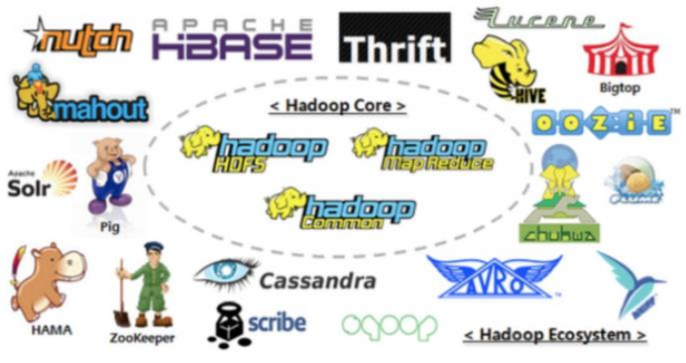
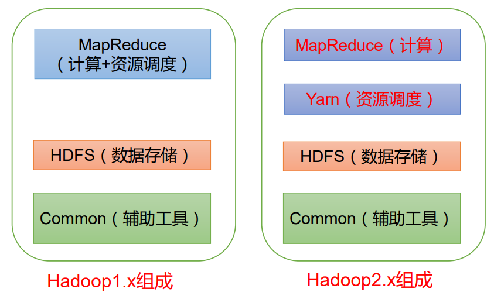
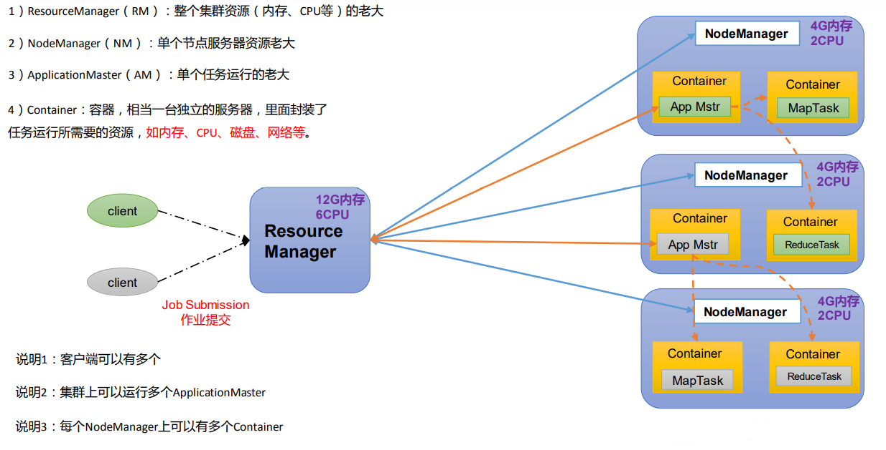
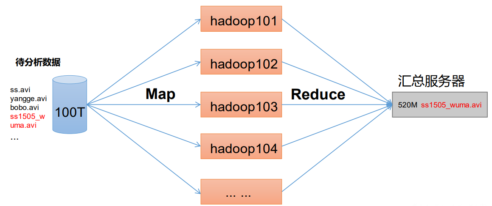
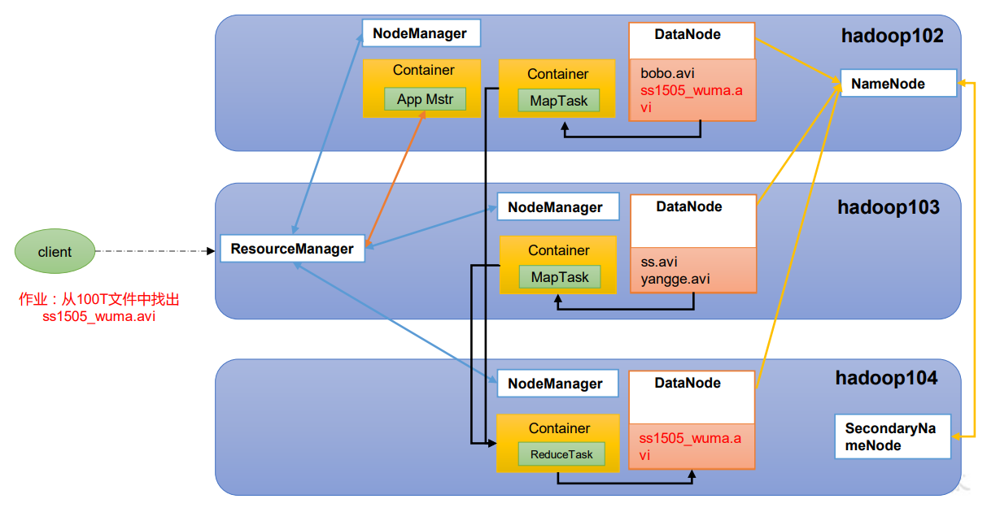
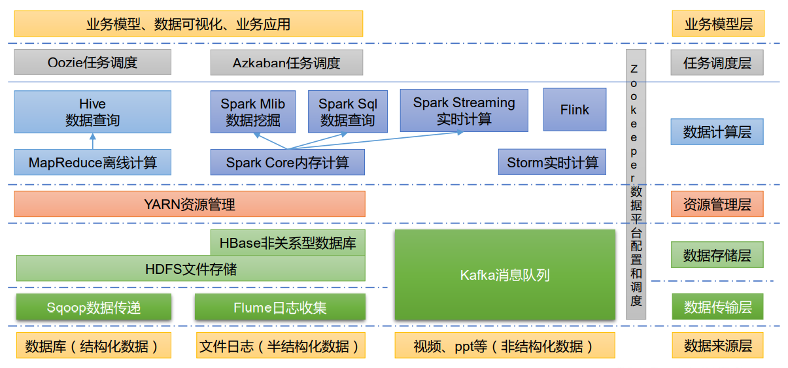
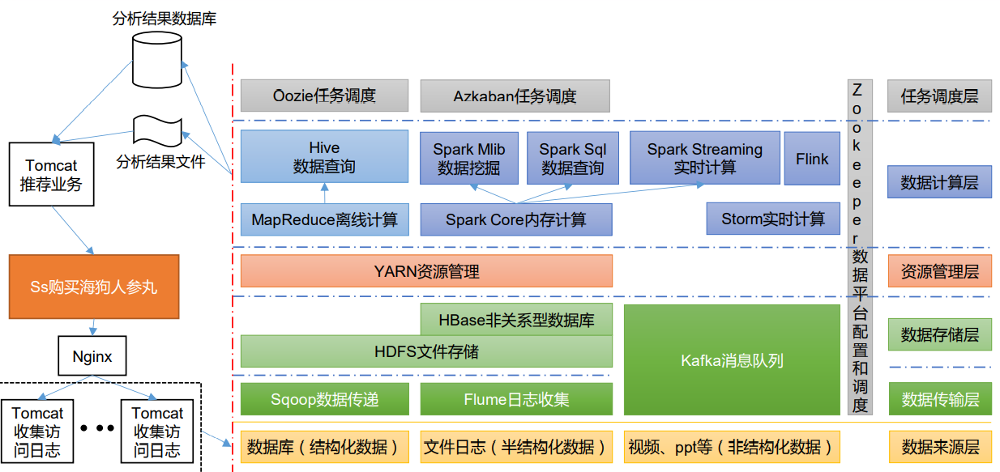

# Hadoop 概述
## Hadoop 是什么
1. Hadoop 是一个由 Apache 基金会所开发的分布式系统基础架构；
2. 主要解决，海量数据的存储和海量数据的分析计算问题；
3. 广义上来说，Hadoop 通常是指一个更广泛的概念 —— Hadoop 生态圈。

## Hadoop 优势
1. 高可靠性：Hadoop 底层维护多个数据副本，所以即使 Hadoop 某个计算元素或存储出现故障，也不会导致数据的丢失；
2. 高扩展性：在集群间分配任务数据，可方便的扩展数以千计的节点；
3. 高效性：在 MapReduce 的思想下，Hadoop 是并行工作的，以加快任务处理速度；
4. 高容错性：能够自动将失败的任务重新分配。

## Hadoop 组成
### Hadoop 1.X 2.X 3.X 区别
在 Hadoop1.X 时代，Hadoop中的 MapReduce 同时处理业务逻辑运算和资源的调度，耦合性较大。
在 Hadoop2.X 时代，增加了 Yarn，Yarn只负责资源的调度，MapReduce 只负责运算。
Hadoop3.X 在组成上没有变化。

### HDFS 架构概述
Hadoop Distributed File System, 简称 HDFS，是一个分布式文件系统。
1. NameNode(nn): 存储文件的元数据，如文件名，文件目录结构，文件属性（生成时间、副本数、文件权限），以及每个文件的块列表和块所在的 DataNode 等。
2. DataNode(dn): 在本地文件系统存储文件块数据，以及块数据的校验。
3. Secondary NameNode(2nn): 每隔一段时间对 NameNode 元数据备份

### YARN 架构概述
Yet Another Resource Negotiator 简称 YARN, 另一种资源协调者，是 Hadoop 的资源管理器。

### MapReduce 架构概述
MapReduce 将计算过程分为两个阶段：Map 和 Reduce
1. Map 阶段并行处理输入数据
2. Reduce 阶段对 Map 结果进行汇总

查找视频：

### HDFS YARN MapReduce 三者关系

## 大数据生态体系

1. Sqoop: Sqoop 是一款开源的工具，主要用于在 Hadoop、Hive 与传统的数据库(MySQL) 间进行数据的传递，可以将一个关系型数据库中的数据导入 Hadoop 的 HDFS 中，也可以将 HDFS 的数据导入关系型数据库；
2. Flume: Flume 是一个高可用的，高可靠的，分布式的海量日志采集、聚合和传输的系统，Flume 支持在日志系统中定制各类数据发送方，用于收集数据；
3. Kafka: Kafka 是一种高吞吐量的分布式发布订阅消息系统；
4. Spark：Spark 是当前最流行的开源大数据内存计算框架。可以基于 Hadoop 上存储的大数据进行计算；
5. Flink：Flink 是当前最流行的开源大数据内存计算框架。用于实时计算的场景较多；
6. Oozie：Oozie 是一个管理 Hadoop 作业(job)的工作流程调度管理系统；
7. Hbase：HBase 是一个分布式的、面向列的开源数据库。HBase 不同于一般的关系数据库，它是一个适合于非结构化数据存储的数据库；
8. Hive：Hive 是基于 Hadoop 的一个数据仓库工具，可以将结构化的数据文件映射为一张数据库表，并提供简单的 SQL 查询功能，可以将 SQL 语句转换为 MapReduce 任务进行运行。其优点是学习成本低，可以通过类 SQL 语句快速实现简单的 MapReduce 统计，不必开发专门的 MapReduce 应用，十分适合数据仓库的统计分析；
9. ZooKeeper：它是一个针对大型分布式系统的可靠协调系统，提供的功能包括：配置维护、名字服务、分布式同步、组服务等。

## 推荐系统架构

