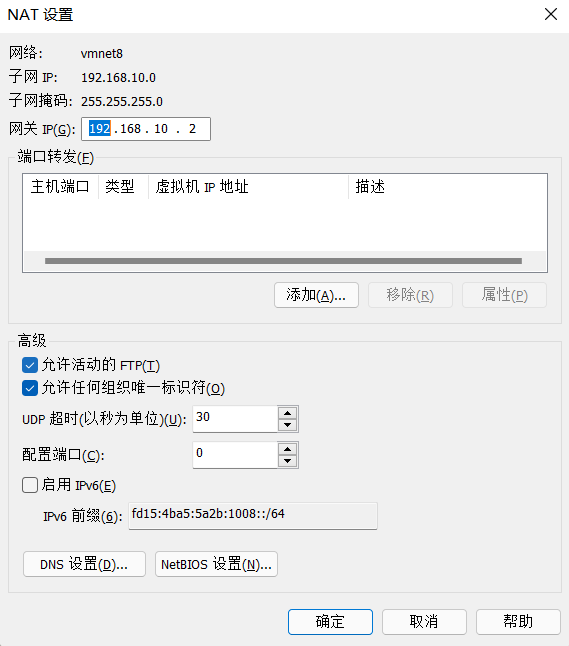
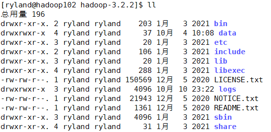

# Hadoop 运行环境搭建
## 模板虚拟机环境准备
1. 安装模板虚拟机，IP 地址 192.168.10.100，主机名称 hadoop100，内存 4G，硬盘 50G，命名为 Hadoop100
2. Hadoop100 虚拟机配置
   1. 可以正常上网 `ping www.baidu.com`
   2. 安装 epel-release(Extra Packages for Enterprise Linux) ,是为红帽系的操作系统提供额外的软件包，适用于 RHEL、CentOS 和 Scientific Linux，相当于是一个软件仓库`yum install -y epel-release`
   3. 如果 Linux 安装的是最小系统版，还需要安装如下工具：
        1. net-tools，工具包集合，包括 ifconfig 等命令
        2. vim
3. 关闭防火墙，关闭防火墙开机自动启动。在企业开发时，通常单个服务器的防火墙是关闭的，公司整体对外会设置防火墙
    ```cmd
    systemctl stop firewalld
    systemctl disable firewalld.service
    ```
4. 创建用户并修改密码
    ```cmd
    useradd ryland
    passwd ryland
    ```
5. 配置用户拥有 root 权限，方便后期加 sudo 执行 root 权限命令
    ```cmd
    vim /etc/sudoers
    ```
修改该文件，在 %wheel 下加一行，不要直接放到 root 行下面，因为所有用户都属于 wheel 组，先配置了 ryland 具有免密功能，但是程序执行到 %wheel 行时，该功能又被覆盖回需要密码。所以 ryland 要放到 %wheel 这行下面
    ```
    ryland ALL=(ALL) NOPASSWD:ALL
    ```
6. 在 opt 目录下创建文件夹并修改所有者和所属组
    ```cmd
    mkdir /opt/module
    mkdir /opt/software
    chown ryland:ryland /opt/module
    chown ryland:ryland /opt/software
    ```
7. 卸载虚拟机自带的 JDK，如果是最小安装则不需要
   1. rpm -qa: 查询所安装的所有 rpm 软件包
   2. grep -i： 忽略大小写
   3. xargs -n1: 表示每次只传递一个参数
   4. rpm -e –nodeps: 强制卸载软件
    ```cmd
    rpm -qa | grep -i java | xargs -n1 rpm -e --nodeps
    ```
8. 重启虚拟机 `reboot`
## 克隆虚拟机
1. 利用模板机 hadoop100（关闭状态），克隆三台虚拟机：hadoop102 hadoop103 hadoop104
2. 修改克隆机 IP，以 hadoop102 举例说明
    1. 修改克隆虚拟机的静态 IP `vim /etc/sysconfig/network-scripts/ifcfg-ens33`，改为
        ```
        DEVICE=ens33
        TYPE=Ethernet
        ONBOOT=yes
        BOOTPROTO=static
        NAME="ens33"
        IPADDR=192.168.10.102
        PREFIX=24
        GATEWAY=192.168.10.2
        DNS1=192.168.10.2
        ```
    2. 查看 Linux 虚拟机的虚拟网络编辑器，编辑->虚拟网络编辑器->VMnet8
   
        
        
    3. 查看 Windows 系统适配器 VMware Network Adapter VMnet8 的 IP 地址

        
    4. 保证 Linux 系统 ifcfg-ens33 文件中 IP 地址、虚拟网络编辑器地址和 Windows 系统 VM8 网络 IP 地址相同
3. 修改克隆机主机名，以 hadoop102 为例
   1. 修改主机名称 `vim /etc/hostname` `hadoop102`
   2. 配置 Linux 克隆机主机名称映射 hosts 文件，打开 /etc/hosts，添加如下内容
        ```
        192.168.10.100 hadoop100
        192.168.10.101 hadoop101
        192.168.10.102 hadoop102
        192.168.10.103 hadoop103
        192.168.10.104 hadoop104
        192.168.10.105 hadoop105
        192.168.10.106 hadoop106
        192.168.10.107 hadoop107
        192.168.10.108 hadoop108
        ```
    3. 重启 `reboot`
    4. 修改 Windows10 的主机映射文件（hosts 文件）
       1. 进入 C:\Windows\System32\drivers\etc 
       2. 拷贝 hosts 文件到桌面
       3. 打开桌面 hosts 文件并添加如下内容
            ```
            192.168.10.100 hadoop100
            192.168.10.101 hadoop101
            192.168.10.102 hadoop102
            192.168.10.103 hadoop103
            192.168.10.104 hadoop104
            192.168.10.105 hadoop105
            192.168.10.106 hadoop106
            192.168.10.107 hadoop107
            192.168.10.108 hadoop108
            ```
        4. 将桌面 hosts 文件覆盖 C:\Windows\System32\drivers\etc hosts 文件
## 安装 JDK
1. 卸载现有 JDK
2. 用 XShell 传输工具将 JDK 导入到 opt 目录下面的 software 文件夹下面
3. 在 Linux 系统下的 opt 目录中查看软件包是否导入成功 `ls /opt/software/`
4. 解压 JDK 到/opt/module 目录下
    ```
    tar -zxvf jdk-8u212-linuxx64.tar.gz -C /opt/module/
    ```
5. 配置 JDK 环境变量
   1. 新建/etc/profile.d/my_env.sh 文件 `sudo vim /etc/profile.d/my_env.sh`
   2. 在 my_env.sh 文件中添加如下内容
        ```
        #JAVA_HOME
        export JAVA_HOME=/opt/module/jdk1.8.0_212
        export PATH=$PATH:$JAVA_HOME/bin
        ```
    3. 执行 `source /etc/profile`，让新的环境变量 PATH 生效 
6. 测试 JDK 是否安装成功 `java -version`，若不成功则重启
## 安装 Hadoop
Hadoop 下载地址：https://archive.apache.org/dist/hadoop/common/hadoop-3.1.3/

1. 用 XShell 文件传输工具将 hadoop-3.1.3.tar.gz 导入到 opt 目录下面的 software 文件夹下面
2. 解压安装文件到/opt/module `tar -zxvf hadoop-3.1.3.tar.gz -C /opt/module/`
3. 将 Hadoop 添加到环境变量
   1. 打开/etc/profile.d/my_env.sh 文件
   2. 在 my_env.sh 文件末尾添加如下内容：
        ```
        #HADOOP_HOME
        export HADOOP_HOME=/opt/module/hadoop-3.1.3
        export PATH=$PATH:$HADOOP_HOME/bin
        export PATH=$PATH:$HADOOP_HOME/sbin
        ```
    3. 使修改生效 `source /etc/profile`
    4. 测试是否安装成功 `hadoop version`，若不成功则重启
## Hadoop 目录结构


重要目录：
1. bin 目录：存放对 Hadoop 相关服务(hdfs, yarn, mapred)进行操作的脚本
2. etc 目录：Hadoop 的配置文件目录，存放 Hadoop 的配置文件
3. lib 目录：存放 Hadoop 的本地库（对数据进行压缩解压缩功能）
4. sbin 目录：存放启动或停止 Hadoop 相关服务的脚本
5. share 目录：存放 Hadoop 的依赖 jar 包、文档、和官方案例
