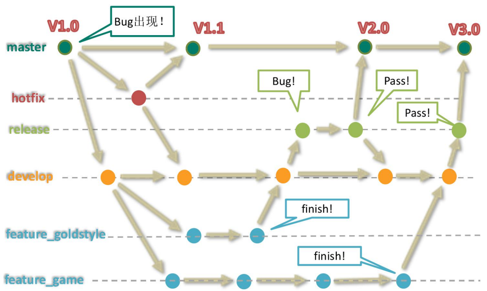

# Git Tutorial
## Config
```cmd
git config user.name [名称]: 仓库级别签名
git config user.email [email address]
git config --global user.name [名称]: 系统级别签名
git config --global userl.email [email address]
```
## Basic commonds
```cmd
git init: 初始化 git
git status: 查看工作区、暂存区状态
git add [文件名]: 将文件添加到暂存区
git rm --cached [文件名]: 将文件从暂存区中移除
git commit -m [日志] [文件名]: 将暂存区文件添加到本地库
git restore [文件名]: 使在工作区但不在缓存区的文件丢弃更改
git restore --staged [文件名]: 将文件从暂存区移除，但不会更改文件内容
```
## Log
```cmd
git log: 查看提交日志
git log --pretty=oneline
git log --oneline
git reflog: HEAD@{移动到该版本需要的步数}
```
## Rest
```cmd
git reset --hard [版本索引]: 移动到指定的版本(recommended)
git reset --hard HEAD^: 回退一个版本
git reset --hard HEAD~3: 回退指定数量的版本
git reset --soft [版本索引]: 在本地库移动 HEAD 指针
git reset --mixed [版本索引]: 在本地库移动 HEAD 指针；重置暂存区
git reset --hard [版本索引]: 在本地库移动 HEAD 指针；重置暂存区；重置工作区
git reset --hard HEAD: 根据 HEAD 指针刷新暂存区和工作区
```
## About Comparation
```cmd
git diff [文件名]: 与暂存区文件比较
git diff HEAD [文件名]: 与指定本地库版本中的文件比较
git diff: 不指定文件名比较所有文件
```
## About branches
```cmd
git branch -v: 查看所有分支
git branch [分支名]: 创建分支
git checkout [分支名]: 切换分支
git checkout -b [分支名]: 创建并切换到该分支
```
## Merge branches
1. 切换到接受合并的分支上 git checkout [被合并分支名];
2. 执行 merge 命令 git merge [有新内容分支名]
## Resolve conflict
1. 修改发生冲突的文件;
2. git add [文件名];
3. git commit -m [日志]
## Configure SSH
1. 生成密钥 ssh-keygen -t rsa -C [email address];
2. 在 github/gitlab 中配置 ssh key;
3. 添加别名 git remote add origin_ssh [远程地址];
4. 测试是否配置成功 ssh -T git@github.com;
5. push 代码 git push origin_ssh [分支名]
## Configure remote address
```cmd
git remote -v
git remote add [远程地址别名] [远程地址]: 配置远程地址别名
git remote rm [远程地址别名]: 删除别名
```
## Clone project
1. 把完整项目下载到本地;
2. 创建远程地址 origin 别名;
3. 初始化本地库
## Push
```cmd
git push [远程地址/远程地址别名] [远程仓库名]: push 到远程仓库，需要添加 collaborators 才可以 push
```
## Merge remote project into local
-  
   1. git fetch [远程地址/远程地址别名] [远程仓库名]: 下载远程代码，不会合并;
   2. git checkout [远程地址/远程地址别名]/[远程仓库名]: 查看远程仓库;
   3. git checkout [本地仓库名];
   4. git merge [远程地址/远程地址别名]/[远程仓库名]
- 
   1. git pull [远程地址/远程地址别名]/[远程仓库名]: git pull = fetch + merge
## Resolve conflict with others
1. developer a 修改文件 F;
2. developer a push 文件 F;
3. developer b 修改文件 F;
4. developer b push 文件 F 失败，提示本地缺少远程存在的工作;
5. developer b pull 远程仓库并处理冲突;
6. developer b push 文件 F
## Develop cross team
1. fork 远程仓库;
2. 将 fork 的仓库 clone 到本地;
3. 开发相关功能并 push 到远程仓库;
4. 发起 pull request;
5. 项目拥有者审核代码并 merge pull request
## Git flow
1. 集中式: 开发人员直接与 origin/master 交互
2. GitFlow

3. Forking: 在 GitFlow 的基础上，更充分利用 git 的 fork 和 pull request 功能。更适合安全可靠地管理大团队的开发者，并且能接受不信任贡献者的提交