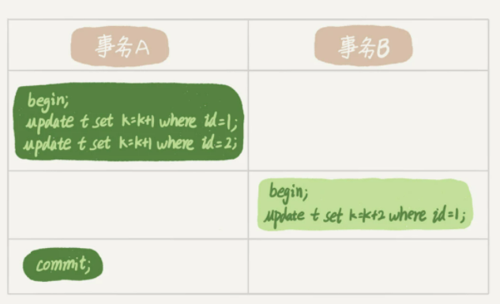

# 行锁的优点与缺点
MySQL 的行锁是在引擎层由各个引擎自己实现的。但并不是所有的引擎如 MyISAN 都支持行锁。不支持行锁意味着并发控制只能使用表锁，同一张表上任何时刻只能有一个更新在执行，这就会影响到业务并发度。InnoDB 是支持行锁的，这也是 MyISAM 被 InnoDB 替代的重要原因之一。

行锁就是针对数据表中行记录的锁。比如事务 A 更新了一行，而这时候事务 B 也要更新同一行，则必须等事务 A 的操作完成后才能进行更新。
## 从两阶段锁说起
在下面的操作序列中，事务 B 的 update 语句执行时会是什么现象呢？假设字段 id 是表 t 的主键。

结论取决于事务 A 在执行完两条 update 语句后，持有哪些锁，以及在什么时候释放。实际上事务 B 的 update 语句会被阻塞，直到事务 A 执行 commit 之后，事务 B 才能继续执行。

***在 InnoDB 事务中，行锁是在需要的时候才加上的，但并不是不需要了就立刻释放，而是要等到事务结束时才释放。这个就是两阶段锁协议。***

如果事务中需要锁多个行，要把最可能造成锁冲突、最可能影响并发度的锁尽量往后放。

假设你负责实现一个电影票在线交易业务，顾客 A 要在影院 B 购买电影票。简化一点，这个业务需要涉及到以下操作：
1. 从顾客 A 账户余额中扣除电影票价；
2. 给影院 B 的账户余额增加这张电影票价；
3. 记录一条交易日志

如果将这三个语句放在一个事务中，如何安排顺序呢？

试想如果同时有另外一个顾客买票，那么语句 2 就冲突了。如果把语句 2 安排在最后，那么影院账户余额这一行的锁时间就最少。这就最大程度地减少了事务之间的锁等待，提升了并发度。但是这并没有完全解决问题。

如果影院做活动，可以低价预售一年内所有的电影票，而且活动只做一天。于是活动时间开始的时候，MySQL 就挂了，CPU 消耗接近 100%，但整个数据库每秒就执行不到 100 个事务。这是什么原因呢？这要涉及到死锁和死锁检测了。

## 死锁和死锁检测
当并发系统中不同线程出现循环资源依赖，涉及的线程都在等待别的线程释放资源时，就会导致这几个线程都进入无限等待的状态，称为死锁。这里用数据库中的行锁举例。

出现死锁以后，有两种策略：
1. 直接进入等待直到超时。超时时间可以通过参数 innodb_lock_wait_timeout 来设置。
2. 发起死锁检测，发现死锁后，主动回滚死锁链条中的某一个事务，让其他事务得以继续执行。将参数 innodb_deadlock_detect 设置为 on，表示开启这个逻辑。

在 InnoDB 中，innodb_lock_wait_timeout 的默认值是 50s，意味着采用第一个策略，当出现死锁以后，第一个被锁住的线程要过 50s 才会超时退出，然后其他线程才有可能继续执行。对于在线服务来说，这个等待时间往往是无法接受的。

但是，我们又不可能直接把这个时间设置成一个很小的值，比如 1s。这样当出现死锁的时候，确实很快就可以解开，但如果不是死锁，而是简单的锁就会出现问题。

所以，正常情况下还是要采用主动死锁检测，而且 innodb_deadlock_detect 的默认值本身就是 on。主动死锁检测在发生死锁的时候，是能够快速发现并进行处理的，但是它也是有额外负担的。

每当一个事务被锁的时候，就要看看它所依赖的线程有没有被别人锁住，如此循环，最后判断是否出现了循环等待，也就是死锁。

那如果是上面说到的所有事务都要更新同一行的场景呢？

每个新来的被堵住的线程，都要判断会不会由于自己的加入导致了死锁，这是一个时间复杂度是 O(n) 的操作。假设有 1000 个并发线程要同时更新同一行，那么死锁检测操作就是 100 万这个量级的。虽然最终检测的结果是没有死锁，但是这期间要消耗大量的 CPU 资源。因此，CPU 利用率很高，但是每秒却执行不了几个事务。

死锁检测要耗费大量的 CPU 资源，那么解决由这种热点行更新导致的性能问题呢？
1. 一种头痛医头的方法，就是如果你能确保这个业务一定不会出现死锁，可以临时把死锁检测关掉。但是这种操作本身带有一定的风险，因为业务设计的时候一般不会把死锁当做一个严重错误，毕竟出现死锁了，就回滚，然后通过业务重试一般就没问题了，这是业务无损的。而关掉死锁检测意味着可能会出现大量的超时，这是业务有损的。
2. 另一个思路是控制并发度。根据上面的分析，你会发现如果并发能够控制住，比如同一行同时最多只有 10 个线程在更新，那么死锁检测的成本很低，就不会出现这个问题。一个直接的想法就是，在客户端做并发控制。但是，你会很快发现这个方法不太可行，因为客户端很多。我见过一个应用，有 600 个客户端，这样即使每个客户端控制到只有 5 个并发线程，汇总到数据库服务端以后，峰值并发数也可能要达到 3000。

因此，这个并发控制要做在数据库服务端。如果有中间件，可以考虑在中间件实现；可以直接修改 MySQL 是源码。基本思路就是，对于相同行的更新，在进入引擎之前排队。这样在 InnoDB 内部就不会有大量的死锁检测工作了。

***那能不能从设计上优化这个问题呢？***
可以考虑通过将一行改成逻辑上的多行来减少锁冲突。还是以影院账户为例，可以考虑放在多条记录上，比如 10 个记录，影院的账户总额等于这 10 个记录的值的总和。这样每次要给影院账户加金额的时候，随机选其中一条记录来加。这样每次冲突概率变成原来的 1/10，可以减少锁等待个数，也就减少了死锁检测的 CPU 消耗。

这个方案看上去是无损的，但其实这类方案需要根据业务逻辑做详细设计。如果账户余额可能会减少，比如退票逻辑，那么这时候就需要考虑当一部分行记录变成 0 的时候，代码要有特殊处理。
## 思考
***Q:***

如果要删除一个表里面的前 10000 行数据，有以下三种方法可以做到：
1. 直接执行 delete from T limit 10000;
2. 在一个连接中循环执行 20 次 delete from T limit 500;第三种，
3. 在 20 个连接中同时执行 delete from T limit 500。

哪一种方案好呢？为什么？

***A:***

第二种方式相对较好。

第一种方式单个语句占用时间长，锁的时间也比较长；而且大事务还会导致主从延迟。

第三种方式会人为造成锁冲突。
